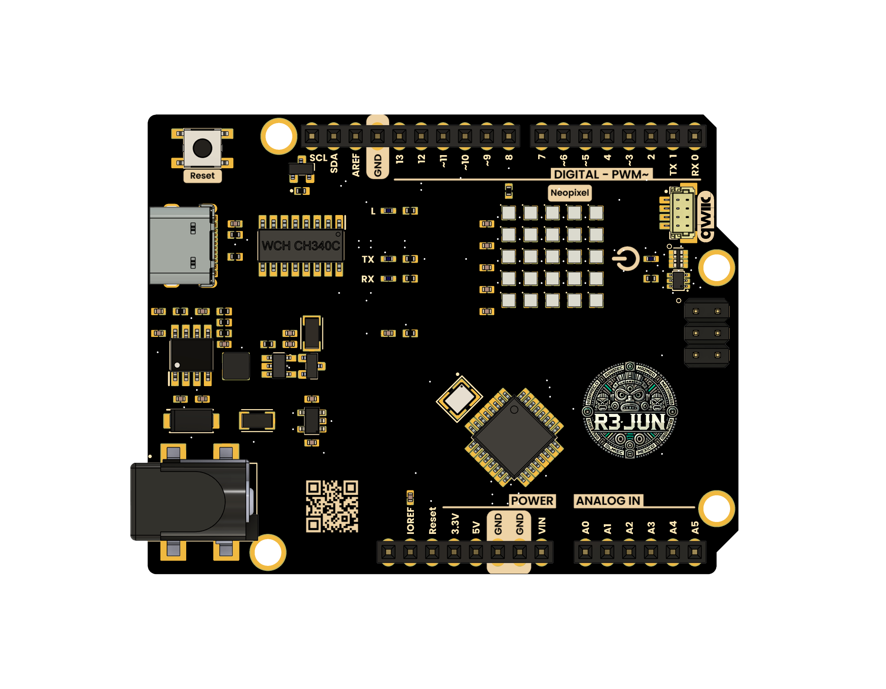

# UNIT JUN R3 Development Board 

## Introduction

UNIT JUN R3 is a versatile and modular development board based on the ATmega328P microcontroller, compatible with the UNO-style form factor. Designed for rapid prototyping, it is well-suited for embedded systems education, interactive projects, and wearable technology. The board offers flexible power input options, modern connectivity, and user-friendly interfaces to streamline development workflows. It also features an integrated 5×5 NeoPixel LED matrix, ideal for creating visual indicators, feedback systems, or simple dynamic displays.

  
  
<em>UNIT Jun R3</em>

### Quick Setup

## Overview

| Feature           | Description                                         |
|-------------------|-----------------------------------------------------|
| Microcontroller   | ATmega328P (8-bit AVR)                              |
| Memory            | 32KB Flash, 2KB SRAM, 1KB EEPROM                    |
| Clock Speed       | 16 MHz                                              |
| Power Supply      | USB-C (5V)            |
| Interfaces        | UART, I2C, SPI, PWM, ADC, GPIO                      |
| NeoPixel Matrix   | 5x5 RGB LED Matrix (WS2812B)                        |
| Connectivity      | USB-C for programming and power                     |
| Form Factor       | UNO-compatible (68.6mm x 53.4mm)                      |
| Development IDEs  | Arduino IDE, PlatformIO                             |
| Onboard Features  | Built-in NeoPixel matrix, user LED, reset button    |

## 

- **Prototyping:** Quickly develop and test embedded system ideas.
- **Education:** Perfect for learning microcontroller basics and electronics.
- **Wearables:** Small size and versatile power make it suitable for wearable devices.
- **Interactive Displays:** Use the built-in NeoPixel matrix for engaging visual output.

## Resources

- [Schematic Diagram](hardware/unit_sch_v_0_0_1_ue0081_Jun-R3.pdf)
- [Pinout Diagram](hardware/resources/pinout/unit_pinout_v_0_0_1_ue0081_unit_jun_r3_en.jpg)
- [Firmware Examples](firmware/)
- [Getting Started Guide](docs/getting_started.md)

## License

All hardware and documentation in this project are licensed under the **MIT License**.  
Please refer to [`LICENSE.md`](LICENSE.md) for full terms.

  Template created by UNIT Electronics

