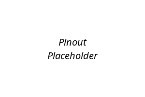
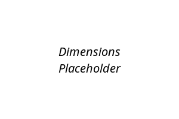

<!--
# README_TEMPLATE.md
This file serves as an input to generate a datasheet-style technical PDF.
Fill in each section without deleting or modifying the existing headings.
-->

# Template Development Board

 <!-- FILL HERE: replace image if needed -->

## Introduction

<!-- FILL HERE -->
Briefly describe the purpose, advantages, and general use of the development board.

## Functional Description

<!-- FILL HERE -->
- Bullet points describing key functional features

## Electrical Characteristics & Signal Overview

<!-- FILL HERE -->
- Operating voltage, current draw, logic levels, ADC resolution, touchpad sensitivity

## Applications

<!-- FILL HERE -->
- Suggested applications (e.g., IoT, automation, monitoring, etc.)

## Features

<!-- FILL HERE -->
- List of main technical features of the microcontroller and board design

## Pin & Connector Layout

| Group     | Available Pins | Suggested Use                          |
|-----------|----------------|----------------------------------------|
| GPIO      | <!-- FILL -->  | <!-- FILL -->                          |
| UART      | <!-- FILL -->  | <!-- FILL -->                          |
| TouchPad  | <!-- FILL -->  | <!-- FILL -->                          |
| Analog    | <!-- FILL -->  | <!-- FILL -->                          |
| SPI       | <!-- FILL -->  | <!-- FILL -->                          |

## Settings

### Interface Overview

| Interface  | Signals / Pins         | Typical Use                              |
|------------|------------------------|------------------------------------------|
| UART       | <!-- FILL -->          | <!-- FILL -->                             |
| I2C        | <!-- FILL -->          | <!-- FILL -->                             |
| SPI        | <!-- FILL -->          | <!-- FILL -->                             |
| USB        | <!-- FILL -->          | <!-- FILL -->                             |

### Supports

| Symbol | I/O         | Description                        |
|--------|-------------|------------------------------------|
| VCC    | Input       | <!-- FILL -->                      |
| GND    | GND         | <!-- FILL -->                      |
| IO     | Bidirectional | <!-- FILL -->                   |

## Block Diagram

 <!-- FILL HERE: replace image if needed -->

## Dimensions

 <!-- FILL HERE: replace image if needed -->

## Usage

<!-- FILL HERE -->
Mention supported development platforms and toolchains 

- (e.g., Arduino IDE, ESP-IDF, PlatformIO, etc.)

## Downloads

<!-- FILL HERE -->
- [Schematic PDF](docs/schematic.pdf)
- [Board Dimensions DXF](docs/dimensions.dxf)
- [Pinout Diagram PNG](docs/pinout.png)

## Purchase

<!-- FILL HERE -->
- [Buy from vendor](https://example.com)
- [Product page](https://example.com/product/template-board)
